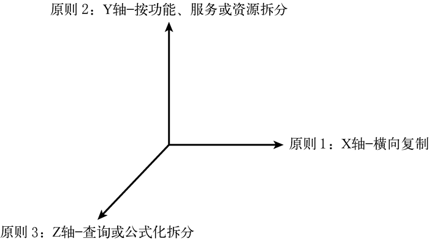
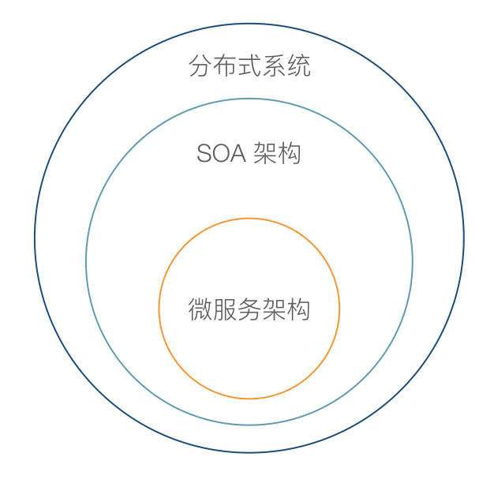

微服务是怎么被划分出来的？
===

我："你觉得我们这个架构用微服务怎么样？"

同事："你的问题是什么？"

我："没有问题，我就是感觉可以用微服务来做这个项目比较好，看了一些资料，微服务有 XXX 特点，感觉挺好的。"

同事："所以，你设计这样一个架构，解决的问题是什么呢？"

我陷入沉思。

早期的时候，每一次和架构师同事讨论问题，当我想要说出我的技术方案时，他总是用这个问题反问我。一开始我被弄得莫名其妙，后来慢慢习惯这种对话方式。其实这是一种问题驱动的思维方式，并且对架构师来说，至关重要。

微服务架构几乎成为互联网公司架构的标准形态，我们在讨论如何划分、设计微服务架构，甚至领域驱动设计（DDD）时，我们应该回归初心，当我们开始讨论怎么划分微服务时，我们应该能回答下面的问题：

- 需要解决的问题是什么？
- 什么是微服务，和 SOA（面向服务的架构） 的区别是什么？
- 为什么是微服务而不是其他架构方式（例如：SOA）？
- 带来的好处是什么？
- 微服务带来的成本有多大？
- 对系统造成的影响是什么？

## 需要解决的问题是什么？

一个几个人的小团队提供的服务一般不会太过于复杂，另外应用也不会特别大，这个时候一个单体应用对团队是非常友好的。不用考虑集成、部署等分布式系统的各种麻烦。实际上，大部分应用程序，还达不到使用微服务这样复杂架构的必要条件。

当团队开始变大，或者应用变得越来越复杂时，会产生几个痛点：

- 应用性能瓶颈，扩容困难
- 故障和系统弹性无法隔离
- 应用复杂到无法理解，模块耦合高，应用职责过多
- 过多的人工作到同一个代码库中
- 应用大到编译、部署时间长


其中，促使开发者从单体应用走向分布式系统最大的动机就是应用性能瓶颈，扩容困难的问题。实际上，当下的工程师们都是在开发广义的 "分布式系统"，因为真正的单体应用系统只存在于大型机、小型机时代了。客户端-服务器模式是一个最基本的分布式系统，无论是 C/S 模式还是 B/S 模式。

"客户端-服务器模式" 把需要单体主机需要全部完成的工作分离到了客户端实现了一次扩容，这个过程对软件行业进行了一次革命。但是随着需求量日益扩张，单纯的"客户端-服务器模式"已经不能满足需求。高性能、大容量的需求往往来自于面向 C（customer） 端的系统，这也解释了为什么分布式系统由面向消费者的公司驱动。Google 和 Salesforce 有海量的在线用户，他们比微软、Oracle 更为热衷分布系统的研发。

当单纯的 "客户端-服务器模式" 不能满足需求时，人们开始寻找新的拓展方式。其中一个方向是将 B/S 模式下的服务器工作下放到浏览器，这就是 SPA（Single Page Application） 富客户端，让前端单页应用承载用户交互和界面相关的工作，让服务器专注于处理业务逻辑和运算。另外一个方向是服务器角色分化：状态和运算分离。将数据库和应用分开部署，将应用中的 Session 入库，让应用无状态化，然后大规模部署应用服务器；剥离和业务无关的组件，例如邮件、文件、推送，演化出独立的服务，分布式文件系统应运而生。然而痛点在于，前面是根据技术进行水平切分，那么如何根据业务模块进行拆分，继续拓展呢？

其次的痛点是故障和系统弹性无法隔离。故障隔离的意思是某部分相对独立的业务中断，不应该影响整个系统。例如一个电商系统，因为某些原因造成无法支付，但是不应该影响用户浏览商品的业务。系统弹性是指应用扩容的需求，单体系统无法做到针对某一部分业务单独扩容，例如秒杀的场景，我们无法针对下单或者结算进行单独扩容。下单造成大流量的访问会导致整个系统不可用。

上面这两个痛点，是从最终用户体验的角度出发，这是真正推动技术进步的原因，也是技术变革产生业务价值的地方。另外三点都是从开发和运维的角度出发，这部分痛点来自开发者，但有可以通过各种方式在单体的应用下改善或克服。

当应用变得非常复杂时，程序变成了一个大泥球（A Big Ball of Mud）。模块之间的依赖关系变得极其复杂，程序开始变得混乱不堪，不过需要提前澄清的是单体或者分布式架构对这个问题无能为力。分布式架构的引入，会让大泥球的代码变成分布式大泥球，进一步增加系统熵 (Entropy，一种物理学概念，系统的混乱程度)。如何避免大泥球呢？后面会谈到可以通过良好的面向对象设计和重构完成。

其次，大的单体还会有编译时间长、部署时间长的问题。如果一个上百人的团队工作在一个代码库中，每天的工作除了在修复冲突之外，就是在等待编译。但这些都不是不可以克服的，Linux 内核就是一个超级单体系统，极长的编译时间和极多的参与人数，但 Linux 项目也能良好的运行。

所以这部分比较啰嗦，毛泽东思想告诉我们，分析问题的时候需要分清主要矛盾和次要矛盾。那么我们在分析系统问题的时候，不仅应该见微知著，也应该抓住关键。

所以问题的关键是系统的 "耦合"，"耦合" 的存在让我们难以拓展、故障隔离、开发困难、无法分开编译。

## 什么是微服务？

根据维基百科的定义，微服务是一种 SOA 的变体，特征是服务之间通过松耦合的方式集成。一般采用轻量级的传输协议（Http），以及不要求服务内采用同样的技术栈实现，通过暴露统一的 WEB API 实现相互通信。

业界对微服务的共识是：

- 服务根据业务能力划分，能提供一定范围内完整的业务价值
- 服务可以单独部署、运维
- 服务可以基于不同的编程语言、数据库等技术实现
- 服务之间使用轻量级的网络协议通讯，例如 HTTP 
- 服务有自己的独立的生命周期
- 服务之间松耦合

"服务根据业务能力划分"和"松耦合"需要特别注意，这是微服务和 SOA 最大的区别。

在解决扩容这个问题上，让我们看下 SOA 和微服务的区别。在解决拓展性的问题，有一个非常好的模型，叫做 "AKF扩展立方"。AKF可扩展立方 （Scalability Cube），来自于《可扩展的艺术》一书。

这个立方体中沿着三个坐标轴设置分别为：X、Y、Z。




- X 轴扩展 —— 无差别的水平的数据和服务复制，具体的实践可以对应为加机器
- Y 轴扩展 —— 根据应用中职责的划分，具体的实践为对各个业务线剥离
- Z 轴扩展 —— 利用特殊属性划分数据集合，例如基于租户模型对用户进行切割

Z 轴拓展实际上非常常见，例如电信运营商基于地域对用户进行划分，北京和上海的用户使用不同的号码段进行管理。微服务出现之前，我们对系统的拓展更多的关注于 X 拓展，负载均衡、读写分离都是为了解决如何进行服务复制来承载更多的请求。SOA 应用进行了一部分的 Y 轴拓展，但是 SOA 和微服务的本质不同在于，SOA 拆分的不是独立的服务，而是组件，SOA 组件必须注册到企业总线或者其他机制中才能对外提供整体的服务。

一个典型的区别在于，SOA 往往将业务逻辑拆分成不同的 SOA 服务，但是数据依然是集中的。业界对微服务的共识在于数据应该被划分到各个微服务中，每个微服务可以独立演进、独立发布甚至独立运营，提供完整的服务能力，并通过松耦合的方式集成。这也是企业实现中台的基本能力。

参考下面的韦恩图，让我们对微服务架构的理解更进一步。



## 为什么我们需要微服务?

水平划分就够了，完全不需要垂直划分，那就不需要微服务。
一个团队开发就够了，完全不需要跨团队协作，那就不需要松耦合，不需要微服务。
如果故障无需隔离，要挂全挂，不需要微服务。

### 微服务的准入清单

在几年的实践中，被强行采用微服务的项目坑过的不少，有过同样体验的朋友不在少数。当服务内的业务逻辑非常单薄时，开发过程中的大部分工作都在处理服务间调用，尤其是服务内聚不够时，让这种情况雪上加霜。

下面是一份微服务的准入清单，帮助我们在技术选型时候，要不要使用微服务：


## 微服务划分方法论

微服务发展至今，已经不是一个前沿概念了。越来越多的公司已经在使用或正在准备采用微服务。尤其是这2-3年间，我参与的项目已经没有不是微服务的了。

同时，微服务已经有非常多成熟的实践，大量开源的微服务框架可以供我们选择，Spring Cloud、Dubbo等框架让我们对微服务的实践难度和成本大大降低。有大量的技术书籍在讨论微服务、分布式架构等技术的具体实现方式，一个公司想要实践微服务已经非常容易了。

我在参与和实践了大量微服务项目过后，让我困惑的往往不是某一个具体技术的选型，服务发现、调用链追踪都有成熟的开源组件帮助我们完成。而让我苦思冥想的另一个问题是：如何把一个单体应用拆分出更合理、更有弹性的微服务架构？

当我查阅企业架构相关的书籍时，了解到IT系统架构不仅需要应对技术架构的挑战之外，还需要应对业务架构方面的挑战。如何从业务的角度出发设计出更加贴切企业战略和业务需求的架构，在适合业务发展和避免过度设计之间取得一个平衡？

在过去大量的实践中，我们的架构师关注在软件的基础设施上，云、数据库分库、数据库分表、集群、负载均衡、认证和授权等这些技术实践上。对于设计一个系统而言，做的第一件事就是关注数据库表、字段、关联。

我们往往忽略了一个非常重要的环节，就是领域建模或者叫做业务架构，这个环节被隐藏到架构师或者技术 Leader 的经验决策中了。在单体应用时期这个问题不是很明显，订单和商品需要设计多少个表、有什么字段、表之间的关联怎么样，富有经验的开发者都能做出合适的决策。

然而在微服务的时代，我们遇到的问题就变成了，订单和产品是否应该划分到两个微服务中，每个服务的职责和边界在哪里，服务之间的API怎么设计，服务之间的依赖关系是什么样子。这部分的架构设计看起来好像和我们做技术选型时考虑的角度不太一样，不再关注技术细节，而是关注于业务细节。相对于处理一些非功能需求，这部分工作对抽象能力、业务分析能力、面向对象能力有了更高的要求。

软件设计是一个复杂的系统问题。于是我们在架构设计中，有两类问题需要解决：同非功能需求相关的技术复杂度，以及和功能需求相关的业务复杂度。

非功能需求是指那些跨功能的通用需求，例如安全、性能、并发等，围绕着这些问题我们发展出了各种解决方案，例如OAuth、缓存技术、负载均衡等，但是这些复杂问题其实和业务是没有关系的。我们把解决这类复杂问题的架构思维叫做技术架构。

功能需求是指用户能操作的使用的需求，例如登录、下单、申请退款，这些复杂问题实际上和采用的技术关系并不大，从编程语言、框架、数据库上来说， 都能完成这些业务要求。无论是 Java、.Net、PHP 以及是否采用微服务，都不妨碍我们完成业务功能。

业务复杂度也是软件开发过程中非常重要的一部分， **我们暂且把解决这类问题的思维方式叫做业务架构**

技术架构大量依赖于实践和经验，在行业内具有相当的通用性，可以采用大量的开源方案。而业务架构解决的问题是如何分析业务逻辑，正确的对业务进行抽象，然后得到合理的软件架构。业务架构非常强的依赖于面向对象的思想和高度的抽象思维，是一线应用开发者主要思考的问题，同公司的产品相关，通用性非常弱。


| -              | 技术架构           | 业务架构           |
| -------------- | ------------------ | ------------------ |
| 实践           | 负载均衡、高可用   | 服务划分、应用解耦 |
| 对开发者的要求 | 主流解决方案的经验 | 抽象、逻辑分析能力 |
| 解决的问题     | 技术复杂度         | 业务复杂度         |

当然，这两种架构思维并不能彻底分开。讨论这两种架构的不同可以帮助我们换种思路去看待架构问题。

业务架构不应该限制于技术细节，在做业务架构的时候应该和我们的业务专家讨论，分析业务在逻辑上的可行性或者矛盾。技术架构则不应该和业务过多的捆绑，架构师讨论这些问题的时候，应该听取某个技术领域中的专家意见，例如更换一种缓存策略是否能大幅度提高性能问题。

另外一个方面，技术架构应该是服务于业务架构，而非凌驾于业务架构之上。尽可能的将最优的技术资源花在核心业务逻辑上，优秀的武器应该首先能打中靶子。

我经历过一个失败的项目。团队致力于开发一个基于云的餐饮管理软件，商户可以非常方便的集中管理连锁餐饮门店 

[TODO]


## 使用 DDD 指导架构设计


微服务时代介绍业务架构方面的资料还非常少。有大量资料讲解如何搭建一套消息中间件，但是很少有资料讲我们需要多少个微服务？微服务架构中，订单和商品一定要两个服务吗？这样划分的依据是什么呢？

所幸，软件开发领域中技术的发展都是有迹可循的。被合理划分成多个微服务的分布式系统，在逻辑上和解耦良好的单体系统是一致的。大家可能都有这样的体会，因为单体应用某些模块已经被良好的解耦了，在划分成多个服务时显得非常自然。例如一个企业应用中，配置管理往往相对独立，一般作为单独的模块设计。在划分微服务的时候很容易划分处理，但是订单、商品、支付等部分往往依赖关系错综复杂，调用关系千丝万缕，做微服务划分时显得艰难。

所以，良好的微服务设计，很重要的一部分就是如何对业务的建模和分析，在逻辑上有一个清晰的关系。

好在十多年前，Eric Evans 提出了“领域驱动设计”，也就是我们常说的 DDD （Domain-Driven Design）。通过 DDD 一系列方法可以从业务出发

架构实践
===

## 某地区电信运营商

## 某船运公司

## 某物联网平台提供商


DDD 基础
===
DDD 通过业务驱动让系统耦合更少，如果耦合变多，以及变复杂了。说明DDD用的不对。

领域模型的目的是支撑业务场景，如果没有场景，或者想象中的场景，属于过度设计。

如果场景变化，修改的地方过多，说明抽象不够。

模型划分方法之一是模型的生命周期不同，寻找聚合根、实体、值对象。

领域建模
===


## 事件风暴工作坊简介

EventStorming 工作坊是 Alberto Brandolini 发明，一种用于领域驱动建模的工作坊形式，中文环境下又被称作为事件风暴工作坊。

工作坊的英文名称是 Workshop 通俗来说就是找一波人在一个大屋子里开会，进行研讨活动。和培训不同的是，工作坊一般没有讲师，也没有固定的内容。工作坊一般会有一个主持人，有些环境下又被称为催化师，负责工作坊的流程和推动，但内容是所有参与者共同完成的。

通过事件这个视角探索一个软件系统中的关键数据流动，然后提取和抽象出共同的对象或实体，从而为软件设计带来极大的便利。这是事件风暴工作坊的基本逻辑。例如通过和业务人员探索“订单已提交”、“支付已完成”、“用户已通知”，从而抽象出 “订单”、“支付”、“通知”等相关模型。

事件风暴工作坊的另外一个特点是，让业务专家和开发人聚到一起研讨软件的设计，它聚焦于业务而非具体的技术。如果亲临事件风暴工作坊的现场，你一定会被业务专家和开发人员的协作感到震惊。开发者往往选用 UML 作为建模的工具，然而哪怕是最轻量级 UML 工具也很难让多个人协同操作。另外，很少有业务人员能了解或者知道怎么使用 UML，因此 Alberto 在遇到这个问题时，采用了最简单直接的方法，用会议室的整面墙壁和便利贴代替屏幕和鼠标。

本篇描述的事件风暴工作坊是根据具体情况不断调整和改进过后的形式，并增加了为微服务设计相关的内容，已经和 Alberto 先生有较大出入。对 Alberto 先生的工作坊形式有兴趣可以访问  https://www.eventstorming.com/ 了解。


为微服务划分设计的事件工作坊基本分为三个阶段：准备工作、战略设计、战术设计

**准备工作**

1. 环境准备
2. 人员调度
3. 物料准备
4. 日程安排
5. DDD 导入培训
6. 人员 DDD 知识摸底
7. 检查准入条件

**战略设计**

1. 识别问题域
2. 业务场景分析
3. 事件风暴
4. 命令风暴
5. 识别领域模型
6. 识别限界上下文
7. 识别上下文关系

**战术设计**

1. 聚焦单个上下文，识别聚合
2. 识别聚合根、实体、值对象

特别的，为了承接事件风暴工作坊的产出，下面是一些微服务设计的后续工作，可以不在工作坊内完成：

1. 通过上下文关系进行微服务设计
2. 通过微服务设计API
3. 通过聚合设计数据库
4. 通过聚合设计代码包

## 工作坊准备

开始事件风暴工作坊之前，有一些准入条件，当这些条件不满足时，不应启动工作坊，强行启动可能不会带来有效的成果和收益。

下面是一份检查清单，稍后会详细解释：

- 工作坊的目标已经明确，确认当前工作坊是为了做重构还是设计目标方案
- 工作坊的范围已经明确
- 业务场景选定
    - 选择最长的业务场景
    - 可以由多个业务场景凭借
    - 选择业务重要性高的场景
    - 选择业务相关性强的场景
- 业务专家已经指定明确
- 技术专家已经指定明确
- 有初步的用户故事地图分析结果（可选）
- 澄清风险


## 战略设计

### 事件风暴

为什么要识别事件？程序=数据结构+算法，软件本身就是一台能通过特定算法并通过修改数据结构的虚拟机器。

因此软件系统可以理解为一种能通过特定响应外部操作进而修改自身状态的虚拟机器，这台机器的生命力来自于响应外部的操作。我们可以通过数据的流动来观察这台机器，那么“事件”就是系统状态改变的关键信息点。

下面是操作步骤：

1. 选定场景范围
2. 在墙上预留空间，根据场景在墙面顶部标出时间线
3. 识别事件，事件以完成时描述，例如 “订单已支付” 
4. 如果多个事件的触发存在条件，可以使用规则，规则代表系统中的一些条件。使用 “xxx规则” 描述
5. 按照时间线发散，补充所有事件
6. 完成一次事件梳理后，进行逆向检查，反方向验证事件是否合理。  
    1. “是否遗漏了事件？”
    2. “事件是否被默认合并了？例如订单已支付，应该还有支付已完成”
    3. “该事件是否一定需要存在？”
7. 重复以上步骤。

[TODO: 操作流程图]

事件风暴是整个工作坊中最重要的一部分。是否能合理的识别出事件，是工作坊成功地重要输入。其中，有一些概念难以理解，下面是我在经历大量实践的过程中总结的一些经验和要点：

- 事件可以理解为对系统状态的修改。
- 事件应该是独立和原子的。
- 事件使用完成时作为约定，标志着系统状态变化结束。例如：用户已注册。
- 避免使用无用的缀词，例如 XXX 已完成。
- 事件一定要前后匹配，这个环节挑战的是业务分析时逻辑是否严丝合缝。例如订单已完成，应该是由上一个事件支付已经完成触发的，否则开发时会缺少逻辑。
- 规则和事件的区别表现在系统中某个算法、逻辑判断还是数据状态的修改。例如验证通过注册成功，这其中包含了一个验证的规则，和用户已注册的事件。
- 这个阶段的事件和业务相关，暂时不要把技术带入
- 如果某些信息在场人员知识不足，或无法做出决定可以先跳过
- 完成一遍事件梳理后进行“逆向检查”
- 忽略现有实现，分析的是现有业务
- 任何对系统状态没有修改的的行为都不算事件。例如显示列表、鼠标滚动。除非系统需要关注用户行为，那么鼠标滚动就成为了事件，需要被考虑和建模。
- 注意不要遗忘和外部系统交互的事件，例如商品是从外部系统同步过来的，应该有“商品已获取”
- 如果是调用外部系统数据，应该使用 “xxx 数据已获取”。表明系统的状态被改变。


这个环节往往占据了这个事件风暴大部分时间，如何确认这个环节的产出是有效的呢？

在后面的环节中可以总结一些经验：

- 一个场景的事件应该是完整自洽的，订单已支付必然存在未支付的情况，通过正反面分析问题。
- 抓住规则，穷尽这个规则后面的所有的事件，例如订单支付成功、不成功、取消、超时等各种情况
- 抓住事件的前后关联，留意伴生事件，例如用户支付成功会不会有消息发送的情况。

最后，我们的工作坊应该是迭代式的，这个环节尽可能挖掘所有的事件，但是现实中即使富有经验的领域专家和业务专家，也无法因此穷尽所有的事件。因此我们必须承认我们会在后面的环节对事件进行调整，因此做好一定的准备。

### 命令风暴

## 战术设计


微服务系统设计
===

微服务划分的参考原则

- 可拆可不拆的，先不拆
- 参考限界上下文作为业务边界
- 参考弹性边界作为云环境下的伸缩边界
- 参考子域划分
- 参考领域模型的设计结果，以及依赖情况，和事务边界对齐
- 结合未来团队、架构组织方式
- 结合 devops 能力
- 和变化对其

## API 设计

API 本身的含义指应用程序接口，包括所依赖的库、平台、操作系统提供的能力都可以叫做 API。我们在讨论微服务场景下的 API 设计都是指 WEB API，一般的实现有 RESTful、RPC等。API 代表了一个微服务实例对外提供的能力，因此 API 的传输格式（XML、JSON）对我们在设计 API 时的影响并不大。

API 设计时微服务设计中非常重要的环节，代表服务之间交互的方式，会影响服务之间的集成。
通常来说，一个好的 API 设计需要满足两个主要的目的：

- **平台独立性。** 任何客户端都能消费 API，而不需要关注系统内部实现。API 应该使用标准的协议和消息格式对外部提供服务。传输协议和传输格式不应该侵入到业务逻辑中，也就是系统应该具备随时支持不同传输协议和消息格式的能力。

- **系统可靠性。** 在 API 已经被发布和非 API 版本改变的情况下，API 应该对契约负责，不应该导致数据格式发生破坏性的修改。在 API 需要重大更新时，使用版本升级的方式修改，并对旧版本预留下线时间窗口。

### API 设计的原则

实践中发现，API 设计是一件很难的事情，同时也很难衡量设计是否优秀。根据系统设计和消费者的角度，给出了一些简单的设计原则。

### 使用成熟度合适的 RESTful API

RESTful 风格的 API 具有一些天然的优势，例如通过 HTTP 协议降低了客户端的耦合，具有极好的开放性。因此越来越多的开发者使用 RESTful 这种风格设计 API，但是 RESTful 只能算是一个设计思想或理念，不是一个 API 规范，没有一些具体的约束条件。

因此在设计 RESTful 风格的 API 时候，需要参考 RESTful 成熟度模型。


| 成熟度等级             | 解释           | 示例           |
| -------------- | ------------------ | ------------------ |
| Level 0           | 定义一个根 URI，所有的操作通过 POST 请求完成   | `POST /?action=changeUserPassword` |
| Level 1 | 创建独立的资源地址，隔离 API 范围 | `POST /user?action=update` |
| Level 2     |   使用 HTTP 动词定义对资源的操作       | `GET /users/001`        |
| Level 3     | 使用 API 超媒体（HATEOAS，返回的 body 中索引相关的资源地址 ）        |    `{"links":["/users/","/products/"]}`     |

根据自己的应用场景选择对应的成熟度模型，一般来说系统成熟度模型在 Level 2 左右。

### 避免简单封装

API 应该服务业务能力的封装，避免简单封装让 API 彻底变成了数据库操作接口。例如标记订单状态为已支付，应该提供形如 `POST /orders/1/pay` 这样的API。而非 `PATCH /orders/1`，然后通过具体的字段更新订单。

因为订单支付是有具体的业务逻辑，可能涉及到大量复杂的操作，使用简单的更新操作将业务逻辑泄漏到系统之外。同时系统外也需要知道 `订单状态` 这个内部使用的字段。

更重要的是，破坏了业务逻辑的封装，同时也会影响其他非功能需求。例如，权限控制、日志记录、通知等。

### 关注点分离 

**好的接口应该做到不多东西，不少东西。** 怎么理解呢？在用户修改密码和修改个人资料的场景中，这两个操作看起来很类似，然后设计 API 的时候使用了一个通用的 `/users/1/udpate` URI。

然后定义了一个对象，这个对象可能直接使用了 `User` 这个类：

```json

{
  "username": "用户名",
  "password": "密码"
}

```
这个对象在修改用户名的时候， `password` 是不必要的，但是在修改密码的操作中，一个 `password` 字段却不够用了，可能还需要 `confirmPassword`。

于是这个接口变成：

```json

{
  "username": "用户名",
  "password":"密码",
  "confirmPassword":"重复密码"
}

```
这种类的复用会给后续维护的开发者带来困惑，同时对消费者也非常不友好。合理的设计应该是两个分离的 API：

```json

// POST /users/{userId}/password

{
  "password":"密码",
  "confirmPassword":"重复密码"
}

```

```json

// PATCH /users/{userId}

{
  "username":"用户名",
  "xxxx":"其他可更新的字段"
}

```
对应的实现，在 Java 中需要定义两个 DTO，分别处理不同的接口。这也体现了面向对象思想中的关注点分离。

### 完全穷尽,彼此独立

API 之间尽量遵守完全穷尽，彼此独立 (MECE) 原则，不应该提供相互叠加的 API。例如订单和订单项这两个资源，如果提供了形如 `PUT /orders/1/order-items/1` 这样的接口去修改订单项，接口 `PUT /orders/1` 就不应该具备处理某一个 `order-item` 的能力。

这样的好处是不会存在重复的 API，造成维护和理解上的复杂性。如何做到完全穷尽和彼此独立呢？

简单的方法是使用一个表格设计 API，标出每个 URI 具备的能力。

| URI             | 业务能力           | 
| -------------- | ------------------ |
|     /orders/1  | 对订单本身操作   | 
|     /orders/1/order-items  | 对订单项操作   | 

资源 URL 设计来源于 DDD 领域建模就非常简单了，聚合根作为根 URL，实体作为二级 URI 设计。聚合根之间应该彻底没有任何联系，实体和聚合根之间的责任应该明确。

产生这类问题的根源还是缺乏合理的抽象。如果存在 API 中可以通过用户组操作用户，通过用户的 URI 操作用户属于的用户组，这其中的问题是缺少了成员这一概念。用户组下面的本质上并不是用户，而是用户和用户组的关系，即成员。

### 版本化

一个对外开放的服务，极大的概率会发生变化。业务变化可能修改 API 参数或响应数据结构，以及资源之间的关系。一般来说，字段的增加不会影响旧的客户端运行。但是当存在一些破坏性修改时，就需要使用新的版本将数据导向到新的资源地址。

版本信息的传输，可以通过下面几种方式

- URI 前缀
- Header
- Query 

比较推荐的做法是使用 URI 前缀，例如 `/v1/users/` 表达获取 `v1` 版本下的用户列表。

常见的反模式是通过增加 URI 后缀来实现的，例如 `/users/1/updateV2`。这样做的缺陷是版本信息侵入到业务逻辑中，对路由的统一管理带来不便。

使用 Header 和 Query 发送版本信息则较为相似，不同之处在于，使用 URI 前缀在 MVC 框架中实现相对简单，只需要定义好路由即可。使用 Header 和 Query 还需要编写额外的拦截器。

### 合理命名

设计 API 时候的命名涉及多个地方：URI、请求参数、响应数据等。通常来说最主要，也是最难的一个是全局命名统一。

其次，命名需要注意这些：

- 尽可能和领域名词保持一致，例如聚合根、实体、事件等
- RESTful 设计的 URI 中使用名词复数
- 尽可能不要过度简写，例如将 `user` 简写成 `usr`
- 尽可能使用不需要编码的字符

用领域名词来对 API 设计命名不是一件特别难的事情。识别出的领域名词可以直接作为 URI 来使用。如果存在多个单词的连接可以使用中横线，例如 `/orders/1/order-items`

### 安全

安全是任何一项软件设计都必须要考虑的事情，对于 API 设计来说，暴露给内部系统的 API 和开放给外部系统的 API 略有不同。

内部系统，更多的是考虑是否足够健壮。对接收的数据有足够的验证，并给出错误信息，而不是什么信息都接收，然后内部业务逻辑应该边界值的影响变得莫名其妙。

而对于外部系统的 API 则有更多的挑战。

- 错误的调用方式
- 接口滥用
- 浏览器消费 API 时因安全漏洞导致的非法访问

所以设计 API 时应该考虑响应的应对措施。针对错误的调用方式，API 不应该进入业务处理流程，及时给出错误信息；对于接口滥用的情况，需要做一些限速的方案；对于一些浏览器消费者的问题，可以在让 API 返回一些安全增强头部，例如：X-XSS-Protection、Content-Security-Policy 等。

## API 设计评审清单

- URI 命名是否通过聚合根和实体统一
- URI 命名是否采用名词复数和连接线
- URI 命名是否都是单词小写
- URI 是否暴露了不必要的信息，例如 `/cgi-bin`
- URI 规则是否统一
- 资源提供的能力是否彼此独立
- URI 是否存在需要编码的字符
- 请求和返回的参数是否不多不少
- 资源的 ID 参数是否通过 PATH 参数传递
- 认证和授权信息是否暴露到 query 参数中
- 参数是否使用奇怪的缩写
- 参数和响应数据中的字段命名统一
- 是否存在无意义的对象包装 例如 `{"data":{}'}`
- 出错时是否破坏约定的数据结构
- 是否使用合适的状态码
- 是否使用合适的媒体类型
- 响应数据的单复是否和数据内容一致
- 响应头中是否有缓存信息
- 是否进行了版本管理
- 版本信息是否作为 URI 的前缀存在
- 是否提供 API 服务期限
- 是否提供了 API 返回所有 API 的索引
- 是否进行了认证和授权
- 是否采用 HTTPS
- 是否检查了非法参数
- 是否增加安全性的头部
- 是否有限流策略
- 是否支持 CORS
- 响应中的时间格式是否采用 `ISO 8601` 标准
- 是否存在越权访问


遗留系统的服务化改造
===


# 简介

本教程致力于介绍微服务架构的设计逻辑，力求清晰易懂，前后连贯。重点围绕解决微服务如何划分这一问题，并介绍如何应对微服务化后带来的其他问题。其中涉及到的技术、方法都是围绕这一思想，技术选型中具体的技术细节请参考相关文档。

教程适合对企业架构有一定了解的开发者、架构师，对架构感兴趣的读者也可参考。

致谢

- 文档构建基于 Pandoc
- 文档样式来源 [https://phodal.github.io/mifa](https://phodal.github.io/mifa)

参考资料
=== 
- https://www.ibm.com/developerworks/cn/java/j-cn-java-and-microservice-1st/index.html 微服务
- https://www.infoq.cn/article/microservices-intro
- https://microservices.io/
https://www.nginx.com/blog/introduction-to-microservices/
- https://xebia.com/blog/eventstorming-continuous-discovery-beyond-software-modelling/ EventStorming; Continuous discovery beyond software modelling
- https://www.jdon.com/50847 EventStorming 超越软件建模的持续发现
- https://herbertograca.com/2017/09/28/clean-architecture-standing-on-the-shoulders-of-giants/ Clean Architecture: Standing on the shoulders of giants
- https://www.jianshu.com/p/b565f0c00c0c 整洁架构(译)
- https://www.jianshu.com/p/eadbec49fbbc?from=timeline&isappinstalled=0 插图版：领域驱动的微服务架构设计工作坊实施步骤
- https://developer.github.com/v3/#current-version 
- https://docs.microsoft.com/en-us/azure/architecture/best-practices/api-design

