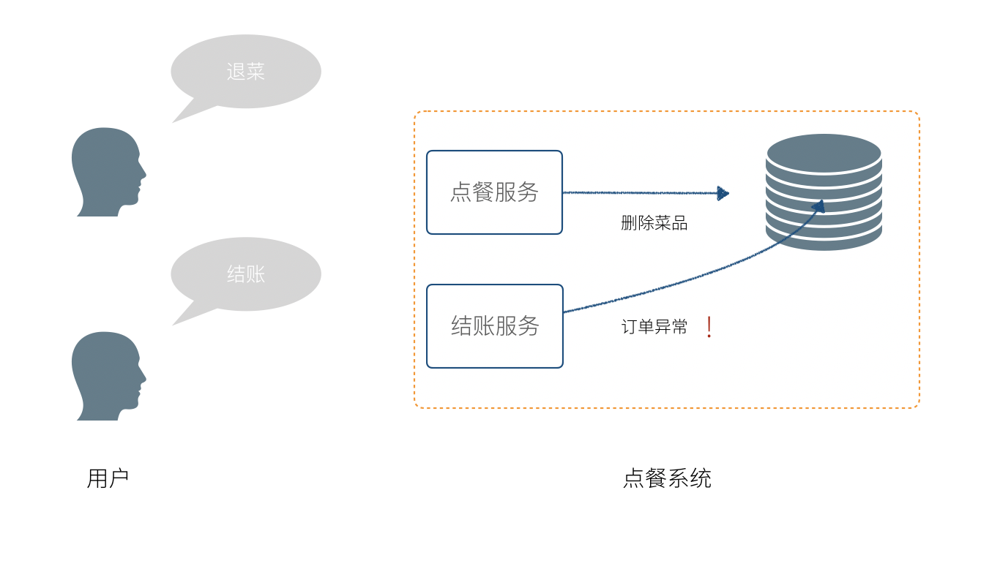
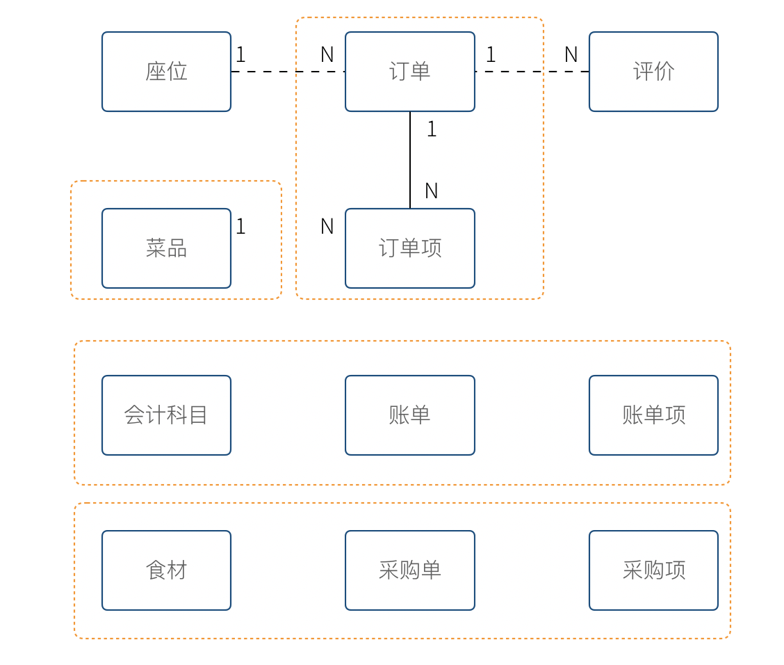
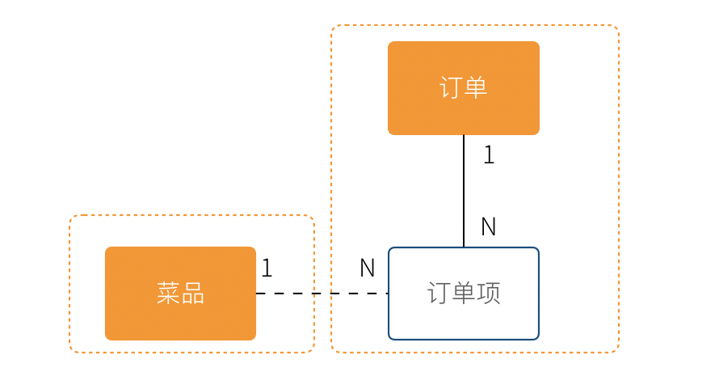
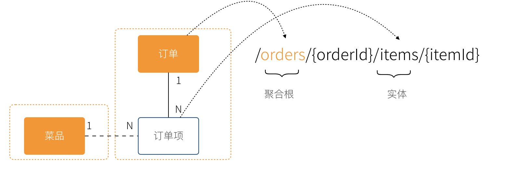
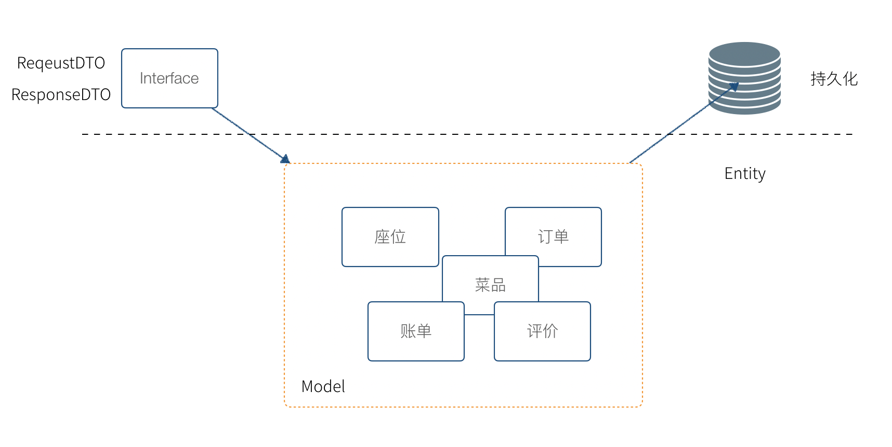
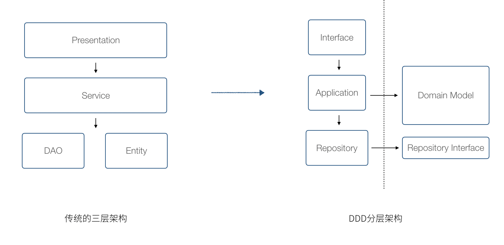
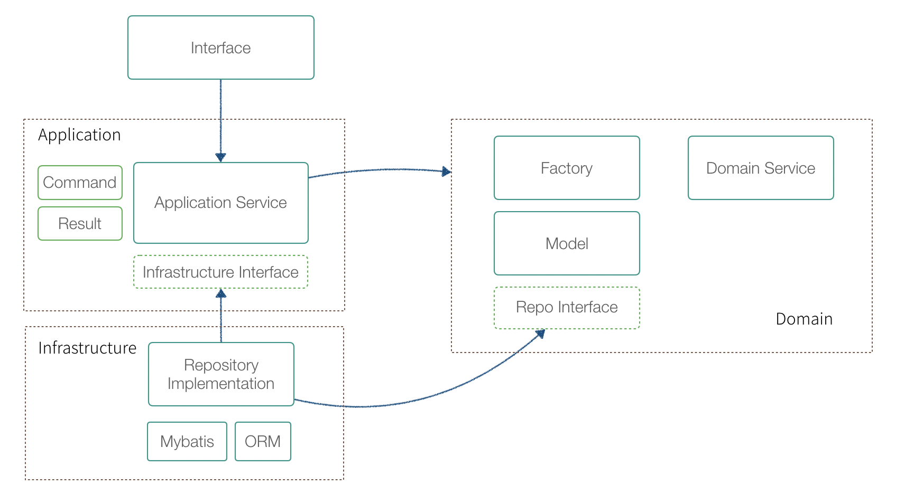

DDD 基础
===

领域驱动设计（DDD） 是 Eric Evans 提出的一种软件设计方法和思想，主要解决业务系统的设计和建模。DDD 有大量难以理解的概念，尤其是翻译的原因，某些词汇非常生涩，例如：模型、限界上下文、聚合、实体、值对象等。

实际上 DDD 的概念和逻辑本身并不复杂，很多概念和名词是为了解决一些特定的问题才引入的，并和面向对象思想兼容，可以说 DDD 也是面向对象思想中的一个子集。如果遵从奥卡姆剃刀的原则，“如无必要，勿增实体”，我们先把 DDD 这些概念丢开，从一个案例出发，在必要的时候将这些概念引入。

## 从纸和笔思考 IT 系统的工作逻辑

让我真正对计算机软件和建模有了更深入的认识是在一家餐厅吃饭的时候。数年以前，我还在一家创业公司负责餐饮软件的服务器端的开发工作，因为工作的原因，外出就餐时常都会对餐厅的点餐系统仔细观察，以便于改进我们自己产品的设计。

一次偶然的情况，我们就餐的餐厅停电了，所幸是在白天，对我们的就餐并没有什么影响。我突然很好奇这家店，在收银系统无法工作的情况下怎么让业务继续运转，因此我饶有趣味的等待服务员来接受我们的点单。

故事的发展并没有超出预期，服务员拿了纸和笔，顺利的完成了点餐，并将复写纸复写的底单麻溜的撕下来交给了后厨。我这时候才回过神来。

**软件工程师并没有创造新的东西，只不过是数字世界的砖瓦工，计算机系统中合乎逻辑的过程，停电后人肉使用纸和笔一样合乎逻辑。**

合乎现实世界的逻辑和和规则，使用鼠标和键盘代替纸和笔，就是软件设计的基本逻辑。如果我们只是关注于对数据库的增、删、改、查（CRUD），实际上没有对业务进行正确的识别，这是导致代码组织混乱的根本原因。

会计、餐饮、购物、人员管理、仓储，这些都是各个领域实实在在发生的事情，分析业务逻辑，从中找出固定的模式，抽象成计算机系统中对象并存储。这就是 DDD 和面向对象思想中软件开发的一般过程。

你可能会想，我们平时不就是这样做的吗?

现实是，我们往往马上关注到数据库的设计上，想当然的设计出一些数据库表，然后着手于界面、网络请求、如何操作数据库上，业务逻辑被封装到一个叫做 Service 对象上，这个对象不承载任何状态，业务逻辑通过修改数据库实现。


一般来说这种方法也没有大的问题，甚至工作的很好，Fowler 将这种方法称作为 **事务脚本（Transaction Script）**。还有其他的设计模式，将用户界面、业务逻辑、数据存储作为一个“模块”，可以实现用户拖拽就可以实现简单的编程，.net、VF曾经提供过这种设计模式，这种设计模式叫做 SMART UI。

这种模式有一些好处。

- 非常直观，开发人员学习完编程基础知识和数据库 CRUD 操作之后就可以开发
- 效率高，能短时间完成应用开发
- 模块之间非常独立

麻烦在于，当业务复杂后，这种模式会带来一些问题。

虽然最终都是对数据库的修改，但是中间存在大量的业务逻辑，并没有得到良好的封装。客人退菜，并不是将订单中的菜品移除这么简单。需要将订单的总额重新计算，以及需要通知后厨尝试撤回在坐的菜。

不长眼的新手程序员擅自修改数据片段，整体业务逻辑被破坏。这是因为并没有真正的一个 “订单” 的对象负责执行相关的业务逻辑，`Sevice` 上的一个方法直接就对数据库修改了，保持业务逻辑的完整，完全凭程序员对系统的了解。



我们在各个餐厅交流的时候，发现这并不是一个 IT 系统的问题。某些餐厅，所有的服务员都可以收银，即使用纸和笔，收营员划掉菜品没有更新小计，另外的服务员结账时会发生错误。于是餐厅，约定修改菜品必须更新订单总价。

我们吸收到这个业务逻辑到 IT 系统中来，并意识到系统中这里有一些隐藏的模型：

- 订单
- 菜品

我们决定，抽象出订单、菜品的对象，菜品不应该被直接修改，而是通过订单才能修改，无论任何情况，菜品的状态变化都通过订单来完成。

复杂系统的状态被清晰的定义出来了， `Service` 承担处理各个应用场景的差异，模型对象处理一致的业务逻辑。

在接触 Eric Evans 的 DDD 概念之前，我们没有找到这种开发模式的名字，暂时称作为 **朴素模型驱动开发**。


## 模型和领域模型

从上面的例子中，模型是能够表达系统业务逻辑和状态的对象。

模型是一个非常宽泛的概念，任何东西都可以是模型，我们尝试给模型下一个定义，并随后继续将领域模型的概念外延缩小。

**模型，用来反映事物某部分特征的物件，无论是实物还是虚拟的** 古人用八个卦象作为世界运行规律的模型；地图用线条和颜色作为地理信息的模型；IT 系统用 E-R 作为对象或者数据库表关系的模型；

我们知道要想做好一个可持续维护的 IT 系统，实际上需要对业务进行充分的抽象，找出这些隐藏的模型，并搬到系统中来。如果发生在餐厅的所有事物，都要能在系统中找到对应的对象，那么这个系统的业务逻辑就非常完备。

现实世界中的业务逻辑，在 IT 系统业务分析时，适合某个行业和领域相关的，所以又叫做领域。

**领域，指的特定行业或者场景下的业务逻辑**。

**DDD 中的模型是指反应 IT 系统的业务逻辑和状态的对象，是从具体业务（领域）中提取出来的，因此又叫做领域模型**。

通过对实际业务出发，而非马上关注数据库、程序设计。通过识别出固定的模式，并将这些业务逻辑的承载者抽象到一个模型上。这个模型负责处理业务逻辑，并表达当前的系统状态。**这个过程就是领域驱动设计。**

我从这里面学到了什么呢？

我们做的计算机系统实际上，是替代了现实世界中的一些操作。按照面向对象设计的话，我们的系统是一个电子餐厅。现实餐厅中的实体，应该对应到我们的系统中去，用于承载业务，例如收银员、顾客、厨师、餐桌、菜品，这些虚拟的实体表达了系统的状态，在某种程度上就能指代系统，这就是模型，如果找到了这些元素，就很容易设计出软件。

后来，如果我什么业务逻辑想不清楚，我就会把电断掉，假装自己是服务员，用纸和笔走一边业务流程。

分析业务，设计领域模型，编写代码。这就是领域驱动设计的基本过程。随后会介绍，如何设计领域模型，当我们建立了领域模型后，会讲解如何使用领域模型指导开发工作。

- 指导数据库设计
- 指导模块分包和代码设计
- 指导 RESTful API 设计
- 指导事务策略
- 指导权限
- 指导微服务划分（有必要的情况）


在我们之前的例子中，收银员需要负责处理收银的操作，同时表达这个餐厅有收营员这样的一个状态。收营员收到钱并记录到账本中，账本负责处理记录钱的业务逻辑，同时表达系统中有多少钱的状态。

## 分析领域模型时，请把”电“断掉

我们进行业务系统开发时，大多数人都会认同一个观点：将业务和模型设计清楚之后，开发起来会容易很多。

但是实际开发过程中，我们既要分析业务，也要处理一些技术细节，例如：如何响应表单提交、如何存储到数据库、事务该怎么处理等。

使用领域驱动设计还有一个好处，我们可以通过隔离这些技术细节，先讲业务逻辑建模，然后再完成技术实现，因为业务模型已经建立，技术细节无非就是响应用户操作和持久化模型。

我们可以吧系统复杂的问题分为两类：

- 业务复杂度
- 技术复杂度


**技术复杂度，软件设计中和技术实现相关的问题，例如处理用户输入，持久化模型，处理网络通信等。**

**业务复杂度，软件设计中和业务逻辑相关的问题，例如为订单添加商品，需要计算订单总价，应用折扣规则等。**

当我们分析业务并建模时，不要关注技术实现，会带来极大的干扰。我学到最实用的思维方法，就是在这个过程把”电“断掉，技术复杂度中的用户交互想象成人工交谈，持久化想象成用纸和笔记录。

DDD 还强调，业务建模应该充分的和业务专家在一起，不应该只是实现软件的工程师自嗨。业务专家是一个虚拟的角色，有可能是一线业务人员、项目经理、或者软件工程师。

由于和业务专家一起完成建模，因此尽量不要选用非常专业的绘图的工具和使用技术语言。可以看出 DDD 只是一种建模思想，并没有规定使用的具体工具。我这里使用 PPT 的线条和形状，用 E-R 的方式表达领域模型，如果大家都很熟悉 UML 也是可以的。甚至实际工作中，我们大量使用便利贴和白板完成建模工作。

这个建模过程可以是技术人员和业务专家一起讨论出来，也可以是使用 ”事件风暴“ 这类工作坊的方式完成。

这个过程非常重要，DDD 把这个过程称作 **协作设计**。

通过这个过程，我们得到了领域模型。


上图使我们通过业务分析得到的一个非常基本的领域模型，我们的点餐系统中，会有座位、订单、菜品、评价几个模型。一个座位可以由多个订单，每个订单可以有多个菜品和评价。

同时，菜品也会被不同的订单使用。

## 上下文、二义性、统一语言

我们用这个模型开发系统，使用领域模型驱动的方式开发，相对于事务脚本的方式，已经容易和清晰很多了，但还是有一些问题。

有一天，市场告诉我们，这个系统会有一个逻辑问题。就是系统中菜品被删除，订单也不能查看。在我们之前的认知里面，订单和菜品是一个多对多的关系，菜品都不存在了，这个订单还有什么用。

菜品，在这里存在了致命的二义性！！！这里的菜品实际上有两个含义：

- 在订单中，表达这个消费项的记录，也就是订单项。例如，5号桌消费的鱼香肉丝一份。
- 在菜品管理中，价格为30元的鱼香肉丝，包含菜单图片、文字描述，以及折扣信息。

菜品管理中的菜品下架后，不应该产生新的订单，同时也不应该对订单中的菜品造成任何影响。

这些问题是因为，技术专家和业务专家的语言没有统一， DDD 认识到了这个问题，统一语言是实现良好的领域模型的前提，因此应该 ”大声的建模“。我在参与这个过程目睹过大量有意义的争吵，正是这些争吵让领域模型变得原来越清晰。

这个过程叫做 **统一语言**。


和现实生活中一样，产生二义性的原因是因为我们的对话发生在不同的上下文中，我们在谈一个概念必须在确定的上下文中才有意义。在不同的场景下，即使使用的词汇相同，但是业务逻辑本质都是不同的。想象一下，发生在《武林外传》中同福客栈的几段对话。


这段对话中实际上有三个上下文，这里的 ”菜“ 这个词出现了三次，但是实际上业务含义完全不同。

- 大嘴说去买菜，这里的菜被抽象出来应该是食材采购品，如果掌柜对这个菜进行管理，应该具有采购者、名称、采购商家、采购价等。
- 秀才说实习生把账单中的菜算错了价格，秀才需要对账单进行管理，这里的菜应该指的账单科目，现实中一般是会计科目。
- 老白说的客人点了一个酱鸭，这里老白关注的是订单下面的订单项，订单项包含的属性有价格、数量、小计、折扣等信息。

实际上，还有一个隐藏的模型——上架中商品。掌柜需要添加菜品到菜单中，客人才能点，这个商品就是我们平时一般概念上的商品。

我们把语言再次统一，得到新的模型。



4个被红色虚线框起来的区域中，我们都可以使用 ”菜品“ 这个词汇（尽量不要这么做），但大家都明确 ”菜品“ 具有不同的含义。这个区域被叫做 **上下文**。当然上下文不只是由二义性决定的，还有可能是完全不相干的概念产生，例如订单和座位实际概念上并没有强烈的关联关系，我们在谈座位的时候完全在谈别的东西，所以座位也应该是单独的上下文。

识别上下文的边界是 DDD 中最难得一部分，同时上下文边界是由业务变化动态变化的，我们把识别出边界的上下文叫做**限界上下文（Bounded Context）**。限界上下文是一个非常有用的工具，限界上下文可以帮助我们识别出业务的边界，并做适当的拆分。

限界上下文的识别难以有一个明确的准则，上下文的边界非常模糊，需要有经验的工程师并充分讨论才能得到一个好的设计。同时需要注意，限界上下文的划分没有对错，只有是否合适。跨限界上下文之间模型的关联有本质的不同，我们用虚线标出，后面会聊到这种区别。


使用上下文之后，带来另外一个收获。模型之间本质上没有多对多关系，如果有，说明存在一个隐含的成员关系，这个关系没有被充分的分析出来，对后期的开发会造成非常大的困扰。

## 聚合根、实体、值对象

上面的模型，尤其是解决二义性这个问题之后，已经能在实际开发中很好地使用了。不过还是会有一些问题没有解决，实际开发中，每种模型的身份可能不太一样，订单项必须依赖订单的存在而存在，如果能在领域模型图中体现出来就更好了。

举个例子来说，当我们删除订单时候，订单项应该一起删除，订单项的存在必须依赖于订单的存在。这样业务逻辑是一致的和完整的，游离的订单项对我们来说没有意义，除非有特殊的业务需求存在。

为了解决这个问题，对待模型就不再是一视同仁了。我们将那相关性极强的领域模型放到一起考虑，数据的一致性必须解决，同时生命周期也需要保持同步，我们把这个集合叫做**聚合**。

聚合中需要选择一个代表负责和全局通信，类似于一个部门的接口人，这样就能确保数据保持一致。我们把这个模型叫做**聚合根**。当一个聚合业务足够简单时，聚合有可能只有一个模型组成，这个模型就是聚合根，常见的就是配置、日志相关的。

相对于非聚合根的模型，我们叫做**实体**。


我们把这个图完善一下，聚合之间也是用虚线链接，为聚合根标上橙色。识别聚合根需要一些技巧。

- 聚合根本质上也是实体，同属于领域模型，用于承载业务逻辑和系统状态。
- 实体的生命周期依附于聚合根，聚合根删除实体应该也需要被删除，保持系统一致性，避免游离的脏数据。
- 聚合根负责和其他聚合通信，因此聚合根往往具有一个全局唯一标识。例如，订单有订单 ID 和订单号，订单号为全局业务标识，订单 ID 为聚合内关联使用。聚合外使用订单号进行关联应用。

还有一类特殊的模型，这类模型只负责承载多个值的用处。在我们饭店的例子中，如果需要对账单支持多国货币，我们将纯数字的 `price` 字段修为 `Price` 类型。

```java

public clsss Price(){
    private String unit;
    private BigDecimal value;    
    
    public Price(String unit,BigDecimal value){
        this.unit = unit;
        this.value = value;
    }
}

```

价格这个模型，没有自己的生命周期，一旦被创建出来就无须修改，因为修改就改变了这个值本身。所以我们会给这类的对象一个构造方法，然后去除掉所有的 `setter` 方法。

我们把没有自己生命周期的模型，仅用来呈现多个字段的值的模型和对象，称作为**值对象**。

值对象一开始不是特备好理解，但是理解之后会让系统设计非常清晰。”地址“是一个显著的值对象。当订单发货后，地址中的某一个属性不应该被单独修改，因为被修改之后这个”地址“就不再是刚刚那个”地址“，判断地址是否相同我们会使用它的具体值：省、市、地、街道等。

值对象是相对于实体而言的，对比如下。

| 实体                   | 值对象                 |
| ---------------------- | ---------------------- |
| 有 ID 标识             | 无 ID 标识             |
| 有自己的生命周期       | 一经创建就不要修改     |
| 可以对实体进行管理     | 使用新的值对象替换     |
| 使用 ID 进行相等性比较 | 使用属性进行相等性比较 |

另外值得一提的是，一个模型被作为值对象还是实体看待不是一成不变的，某些情况下需要作为实体设计，但是在另外的条件下却最好作为值对象设计。

地址，在一个大型系统充满了二义性。

- 作为订单中的收货地址时，无需进行管理，只需要表达街道、门牌号等信息，应该作为值对象设计。为了避免歧义，可以重新命名为收货地址。
- 作为系统地理位置信息管理的情况中具有自己的生命周期，应该作为实体设计，并重命名为系统地址。
- 作为用户添加的自定义地址，用户可以根据 ID 进行管理，应该作为实体，并重命名为用户地址。

我们使用蓝色区别实体和聚合根，更新后的模型图如下：


虽然我们使用 E-R 的方式描述模型和模型之间的关系，但是这个 E-R 图使用了颜色、虚线，已经和传统的 E-R 图大不相同，把这种图暂时叫做 **CE-R** 图（Classified Entity Relationship）。DDD 没有规定如何画图，你可以使用其他任何画图的方法表达领域模型。

## 使用领域模型指导程序设计

在了解到 DDD 之前，到底该用一对多和多对多关系？RESTful API 设计时到底应该选哪一个对象作为资源地址，评价应该放到订单路径下还是单独出来？订单删除相关有多少对象应该纳入事务管理？

在没有领域模型之前，这些大概率凭借经验决定，当我们把领域模型设计出来之后，领域模型可以帮助我们做出这些指导。领域模型不只是为编写业务逻辑代码使用，这样对领域模型来说就太可惜了。

下面是领域模型指导软件开发的一些方面，具体细节后面会再逐个讨论。

### 指导数据库设计

通过 CE-R 图，我们明显可以设计出数据库了。不过还有一些细节需要注意。

首先，在之前的认知里面，多对多关系是非常正常的。但是通过对领域模型的分析后发现，传统处理多对多关系时，需要额外增加一张关联表，这张关联表本质上是一个”关系“的实体没有被发掘出来。否则，在实际开发中会造成系统耦合，以及使用 ORM 的时候产生困惑。

菜品和订单之间是多对多关系吗？

如果是，菜品和订单之间耦合了。实际上，菜品的管理处于系统操作的上游，菜品不依赖订单的任何操作，也就是说订单的任何变化菜品无需关心。

订单拥有多个订单项，每个订单项从菜品读入数据并拷贝，或者引用一个菜品的全局 ID （菜品在另外一个聚合）。这样在设计表结构时订单和订单项关联，订单项不关联菜品。订单项应该从程序读取菜品信息。看起来多对多的关系，被细致分析后，变成了一个一对多关系。



在使用 ORM 时，良好的领域模型尤其有用。不合适的关联关系不仅让 ORM 关联变得混乱，还会让 ORM 的性能变差。

使用领域模型建立数据库的要点：

- 留意多对多关系，并拆解成一对多关系
- 将外键放到实体上
- 值对象和实体为一对一关系，值对象中保存实体的主键即可，无需为值对象分配 id
- 使用 ORM 时，聚合根和实体可以配置为级联删除和更新

### 指导 API 设计

RESTful API 已经变成了主流 API 设计方式，当设计好领域对象后，设计 API 的难度大大降低。

使用聚合根作为 URI 的根路径，使用实体作为子路径。通过 ID 作为 Path 参数。



值对象没有 ID，应该只能依附于某个实体的路径下做更新操作。


另外根据这个关系，处理批量操作的时候应该在实体的上一级完成，例如批量添加订单的订单项，可以设计为：

```
POST /orders/{orderId}/items-batch
```

不要设计为:

```
POST /orders/{orderId}/items/batch
```

### 指导对象设计

在实践中过程中，像 Java、Typescript具有类型系统的语言，对象很容易被误用。如果 `User` 对象既被拿来当做数据库操作使用，又被拿来当做接口呈现使用，这个类最终变成了上帝类，存在大量可有可无的属性。

例如用户注册时候需要输入重复密码，如果在 `User` 对象中添加 `confirmPassword` 属性，存储时候确并不需要。

因此 DDD 中，数据库各种对象的使用应该针对不同的场景设计。回到我们上面说的技术复杂度和业务复杂度中来。领域模型解决业务复杂度的问题，领域模型只应该被用作处理业务逻辑，存储、业务表现都应该和领域模型无关。



简单来说，可以把这些 `Plain Object` 分为三类:

- DTO，和交互相关或者和后端、第三方服务对接
- Entity，数据库表映射
- Model，领域模型
  
另外，在使用领域模型使用上也需要额外注意

- 领域对象尽量使用组合的方式，而不是继承，现实业务逻辑中继承这种概念实际上很少。例如菜品的设计，有热菜、汤菜、凉菜，实际上这里面并不是菜的继承，而应该抽象出分类这个模型。
- 不要滥用领域模型，有些业务逻辑，实在找不出一个领域模型很正常，所以 DDD 中存在一个领域服务。例如，生成一个 UUID。有些业务逻辑不持有系统业务状态，Eric 的书中比喻为像加油站一样的业务逻辑。

### 指导代码组织

代码组织，通俗来说就是如何分包。一种狭义的对 DDD 的理解就是指按照 DDD 风格进行代码组织，虽然 DDD 的内容远不止于此。

在很长一段时间，我对 DDD 分包策略陷入困惑，后来我明白到，讨论 DDD 风格的分包，必须将单体引用和微服务应用分开考虑。

> 微服务应用在逻辑上和解耦良好的单体应用是一致的。

但是微服务是一种分布式架构，映射到单体应用中，各个包分布到不同的服务器中了。我们先以单体应用入手，最后再讨论如何将单体应用架构映射到到微服务中。

在事务脚本的模式中，我们一般将代码分为三层架构。DDD 特别的抽离出一层叫做 `application`。这一层是 DDD 的精华，领域模型关心业务逻辑，但是不关心业务场景。

`application` 用来隔离业务场景，显得非常重要。举个例子，用户被添加到系统中，领域模型处理的是：

1. 用户被添加
2. 授予基本权限
3. 积分规则创建
4. 账户创建（三户模型，客户、用户、账户往往分开）
5. 客户资料录入

但是，用户被添加到系统中由多个应用场景触发。

- 用户被邀请注册
- 用户自己注册
- 管理员添加用户

`application` 需要隔离应用场景，并组织调配领域服务，才能使得领域服务真正被复用。因此 `application` 需要承担事务管理、权限控制、数据校验和转换等操作。当领域服务被调用时，应该是纯粹业务逻辑，并与场景无关。

如果我们将三层架构和 DDD 架构对比，DDD 架构如右图所示。



我们将 DDD 的代码架构展开，可以看到更为细节的内容。 DDD 代码实现上需要 `Repository`、`Factory` 等概念，但这些是可选的，我们在后面具体讲代码结构的部分再阐述。



我们再来看，DDD 的单体应用架构映射到微服务架构下会是怎么样的。


微服务必须考虑到不再是一种服务器，`Domain` 层被抽离出来作为 `Domain Server` 存在，`Domain Server` 不关心业务场景，因此不需要 `application` 层。`Application Server` 需要 `Application` 层，`Domain` 层由后端的 `Domain Server` 提供。

另外补充，一些 DDD 代码组织的基本逻辑：

- 隔离业务复杂度和技术复杂度
- 使用接口隔离有必要的耦合和依赖倒置